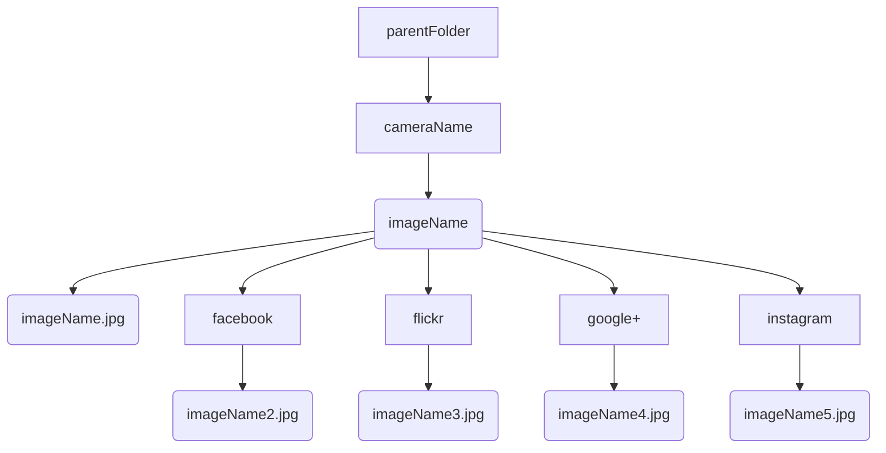
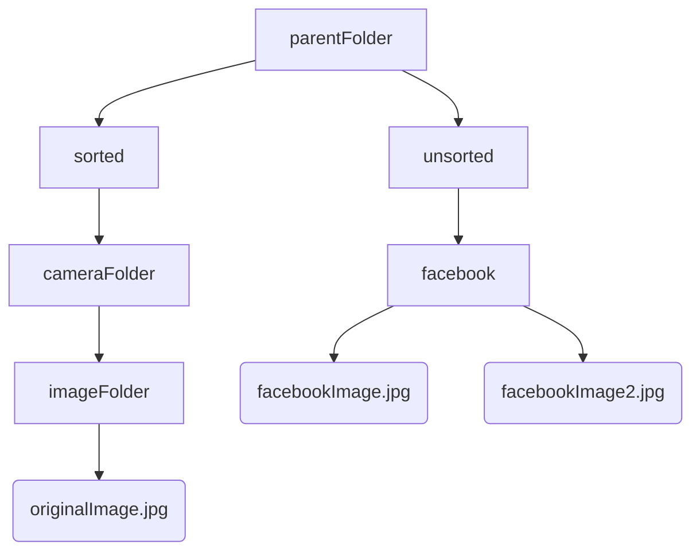

# IBSNtools

## Description
IBSNtools is a set of tools for analyzing image ballistics in social networks written in Python. These tools can be used to compare images uploaded to various social networks to the original image files. These tools will display whether or not the image data has been modified after being uploaded to a social network. IBSNtools analyzes whether or not the images have been re-named, re-sized or re-compressed. It also analyzes whether or not EXIF data has been stripped or modified. Quantization tables and EXIF data for the images can also be viewed. The data can also be exported to JSON format for further analysis.


## Prerequisites
This program requires Python 3.x as well as the following libraries:
- opencv_contrib_python
- piexif
- numpy
- Pillow


## Installation
Run pip from the main folder to install requirements.
```
pip install -r requirements.txt
```

## Known issues
- Clicking next image too fast on Linux may cause the program to freeze.
- Some of the EXIF data is encoded in byte format and therefore not human-readable.

# How to use
After installing prerequisites and organizing your image files, run ISBNtool.py to start the program.

## Folder structure
In order for the GUI-tool to work, the images have to adhere to a certain folder structure. There should be one parent folder that contains sub-folders named after the cameras used to take the photos. In the camera folders, there should be one folder for each original photo taken by the camera. Inside the image folder, there should be exactly one image file (the original photo), as well as one sub-folder for each social network you have uploaded the original image to. Inside the social network folders there should be exactly one image that was uploaded and downloaded from the respective social network platform.


## Automatically Sort Images


## Viewing Image Data


## Exporting Image Data

