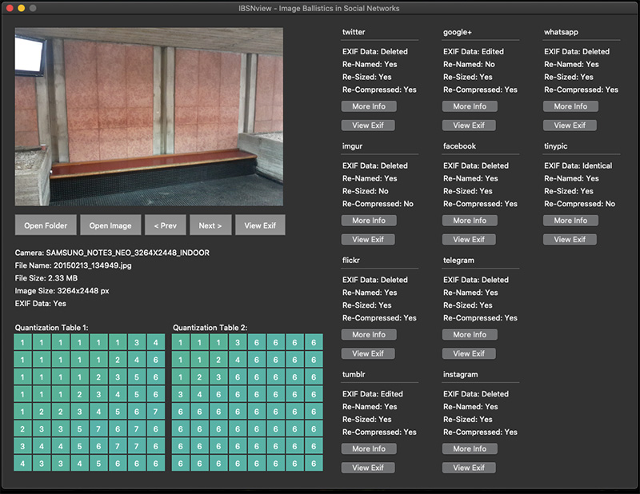

# IBSNtools


## Description
IBSNtools is a set of tools for analyzing image ballistics in social networks written in Python. These tools can be used to organize and compare images uploaded to various social networks to the original image files. The view tool will display whether or not the image data has been modified after being uploaded to a social network. IBSNview analyzes whether or not the images have been re-named, re-sized or re-compressed. It also analyzes whether or not EXIF data has been stripped or modified. Quantization tables and EXIF data for the images can be viewed, and the data can also be exported to CSV format for further analysis.


## Prerequisites
This program requires Python 3.x as well as the following libraries:
- opencv_contrib_python
- piexif
- numpy
- Pillow


## Installation
Run pip from the main folder to install requirements.
```
pip install -r requirements.txt
```

## Known issues
- Clicking next image too fast on Linux may cause the program to freeze.
- Some of the EXIF data is encoded in byte format and therefore not human-readable.

# How to use
After installing prerequisites and organizing your image files, run IBSNview.py to start the program.

## Folder structure
In order for the GUI-tool to work, the images have to adhere to a certain folder structure. There should be one parent folder that contains sub-folders named after the cameras used to take the photos. In the camera folders, there should be one folder for each original photo taken by the camera. Inside the image folder, there should be exactly one image file (the original photo), as well as one sub-folder for each social network you have uploaded the original image to. Inside the social network folders there should be exactly one image that was uploaded and downloaded from the respective social network platform.
```
 imageFolder
├── CANON_650D_720X480_INDOOR
│   ├── IMG_2635
│   │   ├── IMG_2635.JPG
│   │   ├── facebook
│   │   │   └── 1.jpg
│   │   ├── flickr
│   │   │   └── 26204266014_76ce7dd748_b.jpg
│   │   ├── google+
│   │   │   └── IMG_2635.jpg
│   │   ├── imgur
│   │   │   └── 01\ -\ 3POgMpm.jpg
│   │   ├── instagram
│   │   │   └── 12818938_1140129992698752_861157192_n.jpg
│   │   ├── telegram
│   │   │   └── 422116736_16288720980252527992.jpg
│   │   ├── tinypic
│   │   │   └── 34fgw8i.jpg
│   │   ├── tumblr
│   │   │   └── tumblr_o3q9e2zuH21vnf44lo1_1280.jpg
│   │   ├── twitter
│   │   │   └── Cdp0SEgWwAAJQd8.jpg
│   │   └── whatsapp
│   │       └── IMG-20160314-WA0011.jpg
│   └── IMG_2636
│       ├── IMG_2636.JPG
│       ├── facebook
│       │   └── 2.jpg
│       ├── flickr
│       │   └── 26204266044_51bbb1f152_b.jpg
│       ├── google+
│       │   └── IMG_2636.jpg
│       ├── imgur
│       │   └── 02\ -\ i7JYrol.jpg
│       ├── instagram
│       │   └── 12783835_452031228326433_1890673980_n.jpg
│       ├── telegram
│       │   └── 421222168_1084613614143026389.jpg
│       ├── tinypic
│       │   └── 262ky84.jpg
│       ├── tumblr
│       │   └── tumblr_o3q9e2zuH21vnf44lo2_1280.jpg
│       ├── twitter
│       │   └── Cdp0SH4XIAEVkBC.jpg
│       └── whatsapp
│           └── IMG-20160314-WA0010.jpg
├── SAMSUNG_NOTE3_NEO_3264X2448_INDOOR
│   └── 20150213_134949
│       ├── 20150213_134949.jpg
│       ├── facebook
│       │   └── 4.jpg
│       ├── flickr
│       │   └── 26785067056_1e92ac59e0_h.jpg
│       ├── google+
│       │   └── 20150213_134949.jpg
│       ├── imgur
│       │   └── 04\ -\ hrijZwh.jpg
│       ├── instagram
│       │   └── 10616644_224825451205119_1162687156_n.jpg
│       ├── telegram
│       │   └── 421211778_7609660349885752490.jpg
│       ├── tinypic
│       │   └── etw8kj.jpg
│       ├── tumblr
│       │   └── tumblr_o3qaitLYaa1vnf44lo8_1280.jpg
│       ├── twitter
│       │   └── CdqHTrwWAAA0IUm.jpg
│       └── whatsapp
│           └── 8.jpg
└── SONY_POWERSHOT_A2300_4608X3456_OUTDOOR_NATURAL
    └── IMG_9058
        ├── IMG_9058.JPG
        ├── facebook
        │   └── 1.jpg
        ├── flickr
        │   └── 26741407941_760737c219_h.jpg
        ├── google+
        │   └── IMG_9058.jpg
        ├── imgur
        │   └── 01\ -\ WgE4eVV.jpg
        ├── instagram
        │   └── 1169337_1580090438985059_1840711599_n.jpg
        ├── telegram
        │   └── 421932970_1868051944404017215.jpg
        ├── tinypic
        │   └── 30kznsy.jpg
        ├── tumblr
        │   └── tumblr_o415wcLUAA1vnf44lo10_1280.jpg
        ├── twitter
        │   └── Cdp-mPDWAAAcRli.jpg
        └── whatsapp
            └── 5.jpg
```

## Automatically Sort Images
You can use the IBSNsort.py script to automatically sort your downloaded image files. In a parent folder, create one folder called "unsorted" and one folder called "sorted". Ensure that your original image files follow the folder structure of camera folder -> image folder -> image, then move the camera folders you want to use into the "sorted" folder. In the "unsorted" folder, create one folder for each social network you have downloaded images from, then place all the photos from each social network in their respective folders. Now you should be able to run the IBSNsort.py script to automatically sort the images.

```
python3 IBSNsort.py sortFolder
```

### Before sorting:
```
sortFolder
├── sorted
│   ├── CANON_650D_720X480_INDOOR
│   │   └── IMG_2636
│   │       ├── IMG_2636.JPG
│   ├── SAMSUNG_NOTE3_NEO_3264X2448_INDOOR
│   │   └── 20150213_134949
│   │       ├── 20150213_134949.jpg
│   └── SONY_POWERSHOT_A2300_4608X3456_OUTDOOR_NATURAL
│       └── IMG_9058
│           ├── IMG_9058.JPG
└── unsorted
    └── facebook
        ├── 1.jpg
        ├── 2.jpg
        └── 4.jpg
```

### After sorting:
```
sortFolder
├── sorted
│   ├── CANON_650D_720X480_INDOOR
│   │   └── IMG_2636
│   │       ├── IMG_2636.JPG
│   │       └── facebook
│   │           └── 2.jpg
│   ├── SAMSUNG_NOTE3_NEO_3264X2448_INDOOR
│   │   └── 20150213_134949
│   │       ├── 20150213_134949.jpg
│   │       └── facebook
│   │           └── 4.jpg
│   └── SONY_POWERSHOT_A2300_4608X3456_OUTDOOR_NATURAL
│       └── IMG_9058
│           ├── IMG_9058.JPG
│           └── facebook
│               └── 1.jpg
└── unsorted
    └── facebook
        ├── 1.jpg
        ├── 2.jpg
        └── 4.jpg
```

## Viewing Image Data
After your images are sorted, you can run IBSNview.py to browse through the images and their data.

```
python3 IBSNview.py
```

## Exporting Image Data
After your images are sorted and everything looks good in IBSNview, you can run IBSNexport.py to export the data to a CSV file.

```
 python3 IBSNexport.py imageFolder fileName.csv
```

imageFolder is the folder containing your sorted images, and fileName.csv is the name of the output file.
